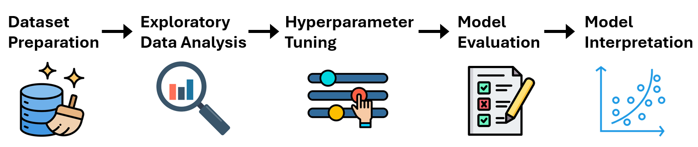
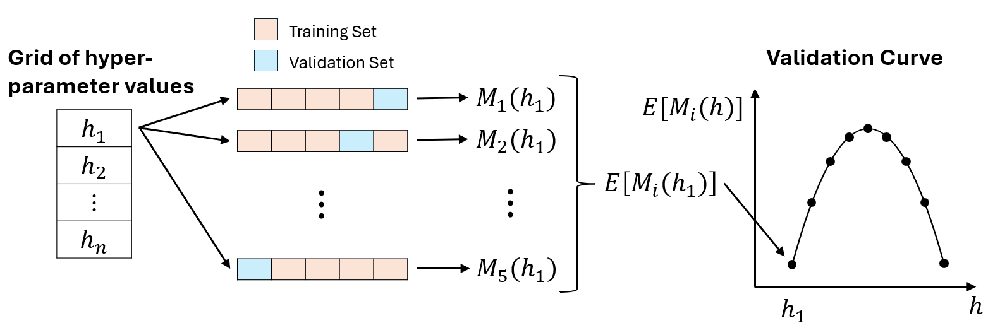

# Predicting mushroom edibility using classification models
{width="1000"}

!!! abstract ""
    :fontawesome-solid-triangle-exclamation: **Problem:** I wanted to predict whether a mushroom is edible using its physical characteristics.

    :material-lightbulb-on-10: **Solution:** I trained several binary classification models (logistic regression, random forest, and k-NN) to predict mushroom edibility. I used AUC to compare the models. I also used random forest to identify the most useful predictors.

    :octicons-graph-16: **Results:** The best models were random forest and k-NN, which both achieved a 1.0 (perfect) test set AUC. The most useful predictors were gill size, gill spacing, and habitat.

## R Code
 :simple-r: [Link to R code](http://blue-fish-0.github.io/code/classification_mushroom_edibility.html){target="_blank"} 

## Dataset Description
The dataset described 1,000 mushrooms, each of which was either poisonous or edible. All of the 9 predictors were categorical, and are described in the table below.

| Variable                        | Type      | Categories     |
|                                 |           |                |
|  Edibility (target variable)  |  Binary   |  edible, poisonous  |
| Bruises                         | Binary    | bruises, no bruises |
| Gill size                       | Binary    | broad, narrow |
| Stalk shape                     | Binary    | enlarging, tapering |
| Cap surface                     | Nominal   | fibrous, grooves, scaly, smooth |
| Gill attachment                 | Nominal   | attached, descending, free, notched |
| Habitat                         | Nominal   | grasses, leaves, meadows, paths, urban, waste, woods |
| Veil color                      | Nominal   | brown, orange, white, yellow |
| Gill spacing                    | Ordinal   | crowded, close, distant |
| Number of rings                 | Ordinal   | zero, one, two |

## Dataset Preparation

**Encoding categorical variables:** I converted each nominal variable into an unordered factor, and each ordinal variable into an ordered factor.

**Train-test split:** I split the dataset into an 80% training set and a 20% test set. This was
necessary because I wanted to estimate each model’s performance on data it was not trained
on (the test set).

## Exploratory Data Analysis

**Target variable distribution:** In the dataset, 50% of the mushrooms were poisonous and the 
remaining 50% were edible. 

**Predictor-target distributions:** 

{width="1000"}
/// caption
Proportion of poisonous mushrooms within each category of each predictor
///
In the figure above, we see that all mushrooms with a 'waste' habitat, an orange veil color, or a brown veil color were edible.  

Meanwhile, mushrooms with 0 rings, a narrow gill size, or a 'paths' habitat had the largest proportion of poisonous mushrooms.

## Hyperparameter Tuning

All the classification models had hyperparameters, which are parameters that
control each model's complexity and that are set before model training. To approximate the 
best hyperparameters, I used grid search, 5-fold cross-validation, and AUC (using the `caret` package). 

For example, if I test 10 sets of hyperparameter values using 5-fold cross validation, 
then I obtain 5 validation set AUC values for each set of hyperparameter 
values. The best set of hyperparameter values has the highest average validation set AUC.

{width="1000"}
/// caption
$M_i(h_j)$ is the value of the validation set evaluation metric for the $j$th set of hyperparameter 
values and the $i$th cross-validation iteration.
///

## Classification Models

### Logistic regression
Logistic regression assumes a linear relationship between the log odds of
a mushroom being poisonous and the predictors. It can handle categorical predictors using one-hot
encoding. 
$$
\log(\frac{p(\boldsymbol{x})}{1-p(\boldsymbol{x})}) = \beta_0 + \beta_1 x_1 + \ldots + \beta_q x_q
$$
where $p(\boldsymbol{x})$ is the probability that mushroom $\boldsymbol{x}$ is poisonous, and $x_i$ equals 1 or 0 (1 if mushroom $\boldsymbol{x}$ belongs to predictor category $i$, 0 otherwise).

The coefficients $\boldsymbol{\beta}$ are calculated by minimizing the objective function. I used elastic-net regularization to prevent overfitting. Elastic-net adds a lasso penalty term and a ridge penalty term to the objective function, which limit the magnitudes of the coefficients.
$$
\underset{\boldsymbol{\beta}}{\mathrm{argmin}}(\mathrm{RSS} + \lambda\sum_{j=1}^{q}[\alpha \beta_j^2 + (1 - \alpha) |\beta_j|])
$$
where $\mathrm{RSS}$ is the residual sum of squares, $\lambda$ is a hyperparameter that
controls the amount of regularization, and $\alpha$ is a hyperparameter that balances the amounts 
of ridge and lasso regularization.

{width="600"}
/// caption
Logistic regression validation heatmap (the best hyperparameter values were $\lambda$ = 0 and $\alpha$ = 0.05)
///
In the figure above, we see that logistic regression models with a large $\alpha$ 
and a large $\lambda$ have a low average validation set AUC because they underfit the data. 
This is because a larger $\alpha$ removes more predictors (more lasso regularization) and a larger $\lambda$ 
penalizes the coefficient magnitudes more.

### Random forest
A classification tree splits the predictor space into regions using recursive binary splitting, then assigns a predicted class (poisonous or edible) for all mushrooms in each new region. 

Since a single classification tree has high variance, a random forest returns the average of a set of classification trees, where each tree is trained on a bootstrap sample of the training set. To decrease the correlation between the trees, each split considers a different random subset $S$ of the predictors. The $\mathrm{mtry}$ hyperparameter controls the size of $S$. 
$$
p(\boldsymbol{x}) = \frac{1}{B}\sum_{b=1}^{B}\hat{y}^b(\boldsymbol{x})
$$
where $p(\boldsymbol{x})$ is the probability that mushroom $\boldsymbol{x}$ is poisonous, $B$ is the number of trees, and $\hat{y}^b(\boldsymbol{x})$ equals 1 or 0 (1 if the classification tree trained on bootstrap sample $b$ predicts  $\boldsymbol{x}$ to be poisonous, 0 otherwise).

{width="600"}
/// caption
Random forest validation curve (the best hyperparameter value was $\mathrm{mtry}$ = 9)
///

### k-NN 
k-Nearest Neighbors (k-NN) is a non-parametric method, meaning it makes no
assumptions about the shape of the decision boundary in the predictor space. 
k-NN classifies each mushroom $\boldsymbol{x}$ using the edibilities of the $k$ nearest 
training set mushrooms to $\boldsymbol{x}$ in the predictor space. $k$ is a hyperparameter.

$$
p(\boldsymbol{x}) = \frac{1}{k}\sum_{\boldsymbol{x}_j\in K(\boldsymbol{x})}^{} y(\boldsymbol{x}_j)
$$
where $p(\boldsymbol{x})$ is the probability that mushroom $\boldsymbol{x}$ is poisonous, 
$K(\boldsymbol{x})$ is the set of the $k$ nearest training set observations to $\boldsymbol{x}$ in 
the predictor space, and $y(\boldsymbol{x}_j)$ equals 1 or 0 (1 if mushroom $\boldsymbol{x}_j$ 
is poisonous, 0 otherwise).

{width="600"}
/// caption
k-nearest neighbors validation curve (the best hyperparameter value was $k$ = 4)
///
In the figure above, we see that k-NN models with a large $k$ have a low average validation set 
AUC because they underfit the data. This is because a larger $k$ creates a smoother decision boundary.

## Model Evaluation

To compare the models across all probability thresholds, I used their AUC
(Area Under Curve) values. We can use AUC because the distribution of the target variable 
in the dataset is balanced. The best model has the largest AUC value (0.5 ≤ AUC ≤ 1).

{width="600"}
/// caption
Test set AUCs for all classification models
///
In the figure above, we observe that random forest and k-NN achieved 1.0 (perfect) test
set AUCs. This means that for every poisonous mushroom in the test set, these models predicted 
a higher probability of being poisonous than for all the edible mushroom in the test set.

## Model Interpretation

In a classification tree, a pure node is a node that only contains poisonous mushrooms, or 
only contains edible mushrooms. The Gini index measures the purity of a node in a classification tree. 
A smaller Gini index value indicates higher purity. 
$$
G(A) = 1 - [p_{\mathrm{poisonous}}^2(A) + p_{\mathrm{edible}}^2(A)]
$$
where $G(A)$ is the Gini index of node $A$, and $p_{\mathrm{poisonous}}(A)$ is the proportion of poisonous
mushrooms in $A$.

Splitting a node $A$ returns a left child node ($A_{\mathrm{left}}$) and a right child node ($A_{\mathrm{right}}$), 
both of which have a smaller Gini index than $A$.
$$
\Delta G(A) = G(A) - [\frac{n(A_{\mathrm{left}})}{n(A)}G(A_{\mathrm{left}})+\frac{n(A_{\mathrm{right}})}{n(A)}G(A_{\mathrm{right}})]
$$
where $\Delta G(A)$ is the decrease in Gini index from splitting node $A$, and $n(A)$ is the number of 
mushrooms in $A$.

Within a random forest, the larger the average decrease in the Gini index for all 
splits using predictor P, the more useful P is.

{width="600"}
/// caption
Random forest predictor importances of the five most important predictors 
///

## Conclusion

The best models were random forest and k-NN, which both achieved a 1.0 (perfect) test set AUC. The most useful predictors were gill size, gill spacing, and habitat.