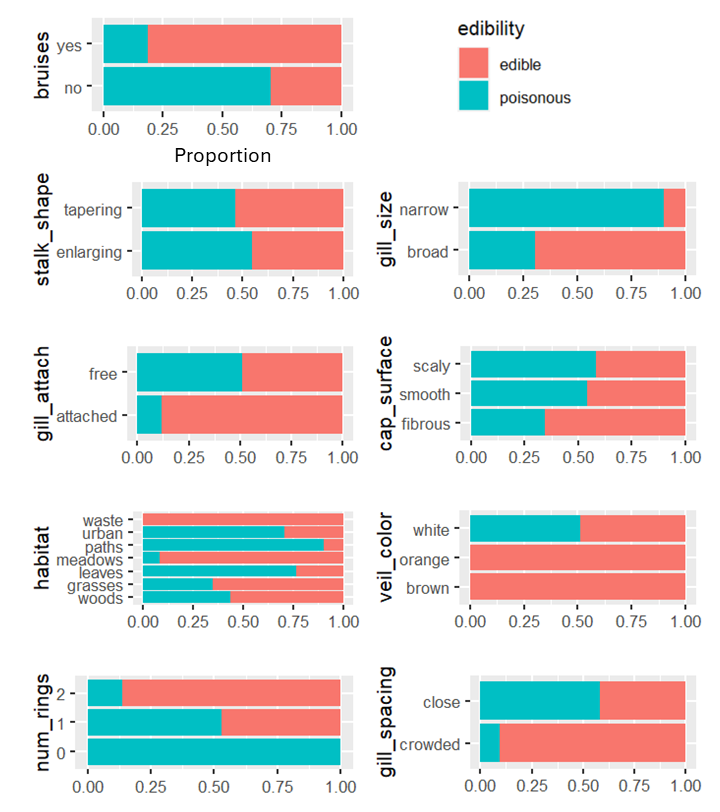
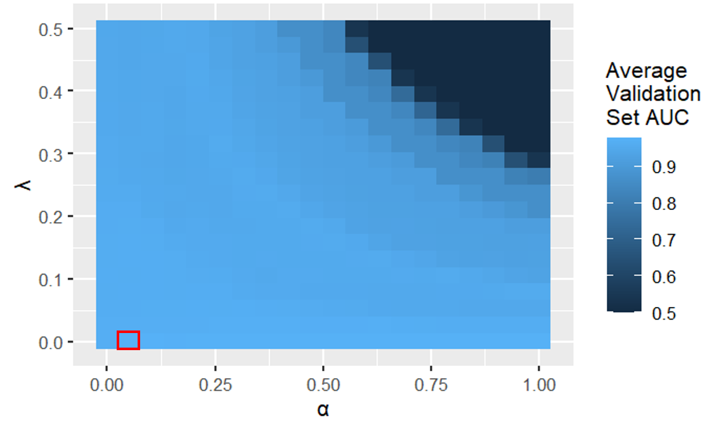
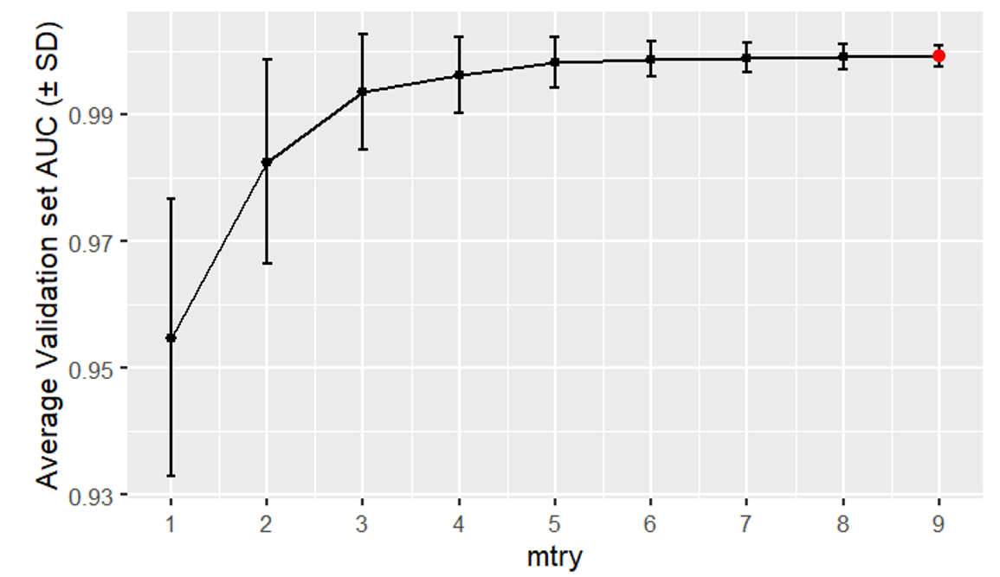
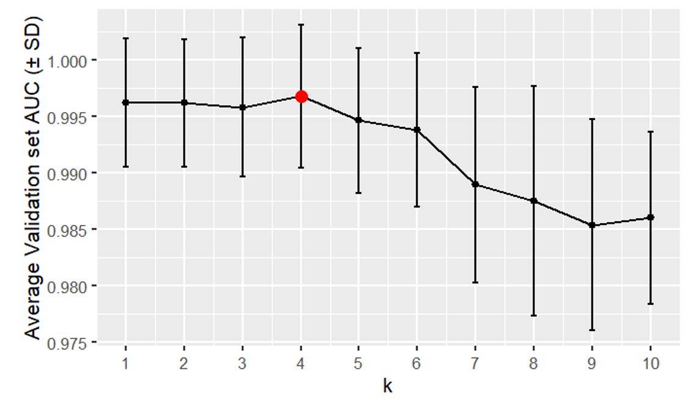
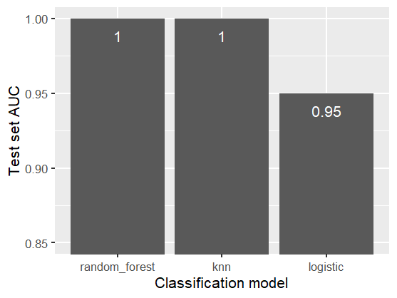
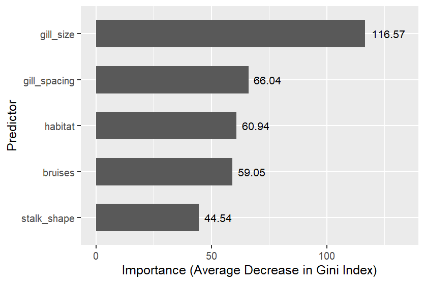

# Predicting mushroom edibility using classification models

!!! abstract ""
    :fontawesome-solid-triangle-exclamation: **Problem:** I wanted to predict whether a mushroom is edible using its physical characteristics.

    :material-lightbulb-on-10: **Solution:** I trained several binary classification models (logistic regression, random forest, and k-NN) to predict mushroom edibility. I used AUC to compare the models. I also used random forest to identify the most useful predictors.

    :octicons-graph-16: **Results:** The best models were random forest and k-NN, which both achieved a 1.0 (perfect) test set AUC. The most useful predictors were gill size, gill spacing, and habitat.

## R Code
 :simple-r: [Link to R code](https://www.google.ca){target="_blank"} 

## Dataset Description
The dataset describes 1,000 mushrooms, each of which is either poisonous or edible. All the 9 predictors are categorical, and are described in the table below.

| Categorical variable            | Type      | Categories                        |
|                                 |           |                                   |
|  Edibility (target variable)  |  Binary   |  edible, poisonous  |
| Bruises                         | Binary    | bruises, no bruises |
| Gill size                       | Binary    | broad, narrow |
| Stalk shape                     | Binary    | enlarging, tapering |
| Cap surface                     | Nominal   | fibrous, grooves, scaly, smooth |
| Gill attachment                 | Nominal   | attached, descending, free, notched |
| Habitat                         | Nominal   | grasses, leaves, meadows, paths, urban, waste, woods |
| Veil color                      | Nominal   | brown, orange, white, yellow |
| Gill spacing                    | Ordinal   | crowded, close, distant |
| Number of rings                 | Ordinal   | zero, one, two |

## Dataset Preparation

**Encoding categorical variables:** I converted each nominal variable into an unordered factor, and each ordinal variable into an ordered factor.

**Train-test split:** I split the dataset into an 80% training set and a 20% test set. This is
necessary because I want to estimate each model’s performance on data it was not trained
on (the test set).

## Exploratory Data Analysis

**Target variable distribution:** In the dataset, 50% of the mushrooms were poisonous and the 
remaining 50% were edible. 

**Predictor-target distributions:** 

{width="1000"}
/// caption
Proportion of poisonous mushrooms within each category of each predictor
///
In the figure above, we see that all mushrooms with a 'waste' habitat, an orange veil color, or a brown veil color were edible.  

Meanwhile, mushrooms with 0 rings, a narrow gill size, or a 'paths' habitat had the largest proportion of poisonous mushrooms.

## Hyperparameter Tuning

All the classification models had hyperparameters, which are parameters that
control the model’s complexity. I used grid search, 5-fold cross-validation, and AUC to approximate
the best hyperparameters (using the `caret` package). For example, if I test 10 sets of
hyperparameter values using 5-fold cross validation, then I obtain 5 validation set errors for
each set of hyperparameter values. The best set of hyperparameter values has the highest
average validation set AUC.

## Classification Models

### Logistic regression
Logistic regression assumes a linear relationship between the log odds of
a mushroom being poisonous and the predictors. It can handle categorical predictors using one-hot
encoding. 
$$
\log(\frac{p(\boldsymbol{x})}{1-p(\boldsymbol{x})}) = \beta_0 + \beta_1 x_1 + \ldots + \beta_q x_q
$$
where $p(\boldsymbol{x})$ is the probability that mushroom $\boldsymbol{x}$ is poisonous, and $x_i$ equals 1 or 0 (1 if mushroom $\boldsymbol{x}$ belongs to predictor category $i$, 0 otherwise).

The coefficients $\boldsymbol{\beta}$ are calculated by minimizing the objective function. I used elastic-net regularization to prevent overfitting. Elastic-net adds a lasso penalty term and a ridge penalty term to the objective function, which limit the magnitudes of the coefficients.
$$
\underset{\boldsymbol{\beta}}{\mathrm{argmin}}(\mathrm{RSS} + \lambda\sum_{j=1}^{q}[\alpha \beta_j^2 + (1 - \alpha) |\beta_j|])
$$
where $\mathrm{RSS}$ is the residual sum of squares, $\lambda$ is the
regularization parameter, and $\alpha$ is the balance between ridge and lasso.

{width="600"}
/// caption
Logistic regression grid search (the best hyperparameter values were $\lambda$ = 0 and $\alpha$ = 0.05)
///
In the figure above, we see that logistic regression models with a large $\alpha$ 
and a large $\lambda$ have a low average validation set AUC because they underfit the data. 
This is because a larger $\alpha$ removes more predictors (lasso regularization) and a larger $\lambda$ 
penalizes the coefficient magnitudes more.

### Random forest
A decision tree splits the predictor space into regions using recursive binary splitting, and each region is assigned a predicted class. Since a single decision tree has high variance, a random forest returns the average of a set of classification trees, where each tree is trained on a bootstrap sample of the training set. To decrease the correlation between the trees, each split only considers a subset of the predictors. The probability of being poisonous is
the proportion of trees that predict poisonous. 
$$
p(\boldsymbol{x}) = \frac{1}{B}\sum_{b=1}^{B}\hat{f}^b(\boldsymbol{x})
$$
where $p(\boldsymbol{x})$ is the probability that mushroom $\boldsymbol{x}$ is poisonous, $B$ is the number of trees, and $\hat{f}^b(\boldsymbol{x})$ equals 1 or 0 (1 if the random forest trained on bootstrap sample $b$ predicts the mushroom $\boldsymbol{x}$ to be poisonous, 0 otherwise).

{width="600"}
/// caption
Random forest grid search (the best hyperparameter value was $\mathrm{mtry}$ = 9)
///
In the figure above, we see that random forest models with a small $\mathrm{mtry}$ have 
a low average validation set AUC because they underfit the data. This is because a smaller 
$\mathrm{mtry}$.

### k-NN 
k-Nearest Neighbors (k-NN) is a non-parametric method, meaning it makes no
assumptions about the shape of the decision boundary. k-NN classifies each observation using
the target variable categories of its $k$ nearest training set observations in the predictor space. A
larger $k$ will return a smoother decision boundary. The probability of being poisonous is the
proportion of neighbors that are poisonous.

{width="600"}
/// caption
k-nearest neighbors grid search (the best hyperparameter value was $k$ = 4)
///
In the figure above, we see that k-NN models with a large $k$ have a low average validation set 
AUC because they underfit the data. This is because a larger $k$ creates a smoother decision boundary.

## Model Evaluation

**AUC:** To compare the models across all probability thresholds, I used their AUC
(Area Under Curve) values. We can use AUC because the target variable distribution in 
the dataset is balanced. The best model has the largest AUC value (0.5 ≤ AUC ≤ 1).

{width="600"}
/// caption
Test set AUCs for all classification models
///
In the figure above, we observe that random forest and k-nearest neighbors achieved 1.0 (perfect) test
set AUCs. This means that across all probability thresholds, these models had zero false
negatives (incorrectly predicted to be edible).

## Model Interpretation

The Gini index measures the purity of a node in a decision tree. A smaller Gini
value indicates higher purity. Each split in a decision tree decreases the Gini index of the
children nodes relative to the parent node. Within a random forest, the larger the average 
decrease in Gini index for all splits using predictor P, the more useful predictor P is.

{width="600"}
/// caption
Random forest predictor importances of the five most important predictors 
///

## Conclusion

The best models were random forest and k-NN, which both achieved a 1.0 (perfect) test set AUC. The most useful predictors were gill size, gill spacing, and habitat.