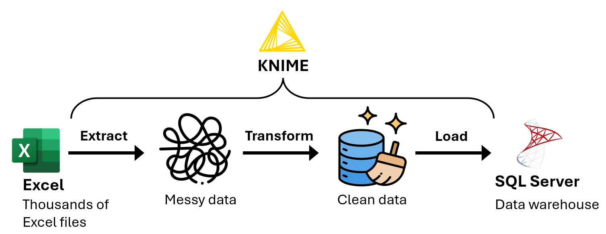
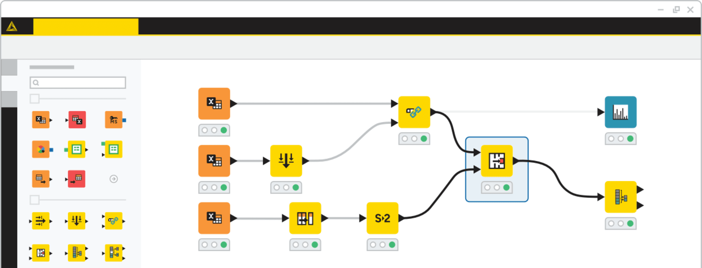

# Automating Tilray's weekly ETL using KNIME and SQL Server

## Summary

{width="1000"}

!!! abstract ""
    :fontawesome-solid-triangle-exclamation: **Problem:** Every week, the analytics team used Power Query to transfom and import new sales and inventory data (stored in over 30 Excel files) into their Power BI reports. After a few years, the Power BI report data refreshes became very slow, because Power Query was transforming data from thousands of Excel files during each data refresh.

    :material-lightbulb-on-10: **Solution:** I used KNIME to develop an ETL program to extract the data from the Excel files, transform the data, then load the transformed data into SQL Server. The analytics team could then import the transformed data from SQL Server into Power BI.

    :octicons-graph-16: **Results:** The analytics team's Power BI report data refreshes became 80% faster.
    

## KNIME
KNIME is a low-code data processing application where you can chain “nodes” to create programs. A node is like a function in a programming language. 

{width="600"}
/// caption
Screenshot of KNIME.
///

## Definitions
{width="1000"}

`f`
:   An Excel file containing sales and inventory data for one week. 

`f.data`
:   The data table extracted from `f`. All columns in `f.data` are the string data type. 

`T`
:   A sequence of data transformations. These include:  

    - Transforming column contents using regular expressions.  
    - Converting column data types.  

`T(f.data)`
:   The resulting table after applying `T` to `f.data`. 

`all_data`
:   A database table that will store `T(f.data)` for every Excel file `f`.

**match**
:   A table `A` matches a table `B` if `A` and `B` have the same column names and data types.
    `T(f.data)` can only be loaded into `all_data` if `T(f.data)` matches `all_data`.

`all_file_names`
:   A set of all the Excel file names.

`loaded_file_names`
:   A set of the Excel file names `f.name` such that `T(f.data)` has been loaded into `all_data`. 

## Pseudocode of the ETL program (similar to Python)

<pre>
<b>Algorithm</b> ETL_program(file_names):  
    <b>Input:</b>   
        file_names: A set of Excel file names.
    <b>Output:</b> A dictionary of (file name, error message) items. 

    not_loaded_file_names = file_names − loaded_file_names. 
    file_name_to_error_message = dict().

    <b>for</b> each Excel file name f.name in not_loaded_file_names:
	    f.data = Extract the data table from f.  
        <b>try:</b>
            T(f.data) = Apply each transformation in T to f.data. 
	        Load T(f.data) into all_data.
	    <b>except</b> Exception as error:
	        file_name_to_error_message[f.name] = str(error).   
	    <b>else:</b> 
	        Add f.name to loaded_file_names.
        
    <b>return</b> file_name_to_error_message.

</pre>
 
After executing `file_name_to_error_message = ETL_program(all_file_names)`, I execute the following steps manually:
<pre>
<b>for</b> f.name, error_message in file_name_to_error_message.items():
    Use error_message to update the data transformations in T. 
    Execute ETL_program(set(f.name)). 
</pre>

## Example execution of the ETL program

`T`:
:   1. Convert `date` to the date data type.    
    2. Convert `column_a` to the integer data type.   

**1. Execute `ETL_program(set(f_1.name))`:**  

{width="800"}
/// caption
`T(f_1.data)` can't be loaded into `all_data` because `"missing"` in `column_a` can't be converted to an integer. 
///

**2. Update `T`:**  

`T`: 
:   1. Convert `date` to the date data type.    
    2. In `column_a`, replace all cells matching the regular expression `“^missing$”` with `null`.
    3. Convert `column_a` to the integer data type.

**3. Execute `ETL_program(set(f_1.name))`:**    

{width="1000"}
/// caption
After updating `T`, `T(f_1.data)` is loaded into `all_data`.
///
