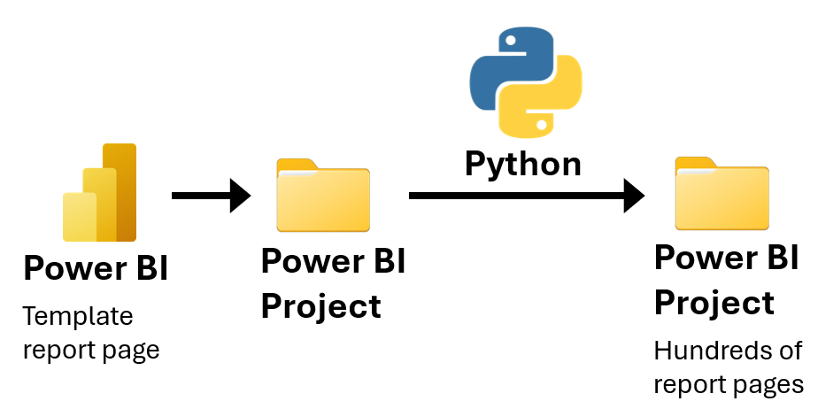
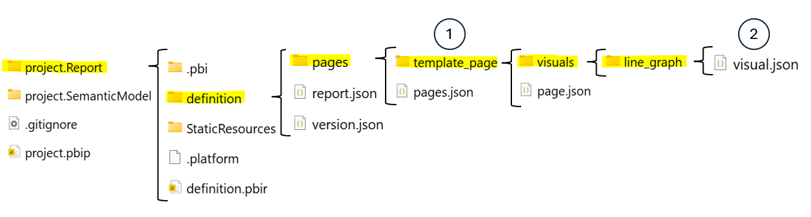
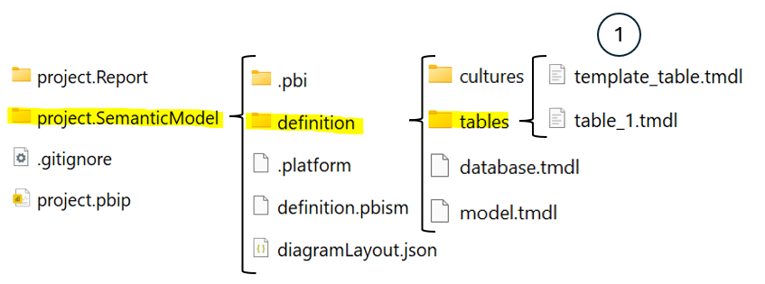
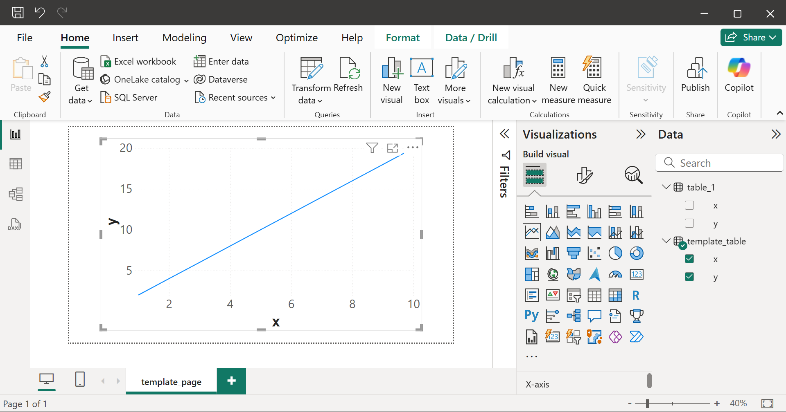
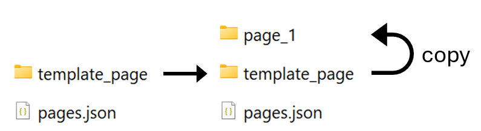
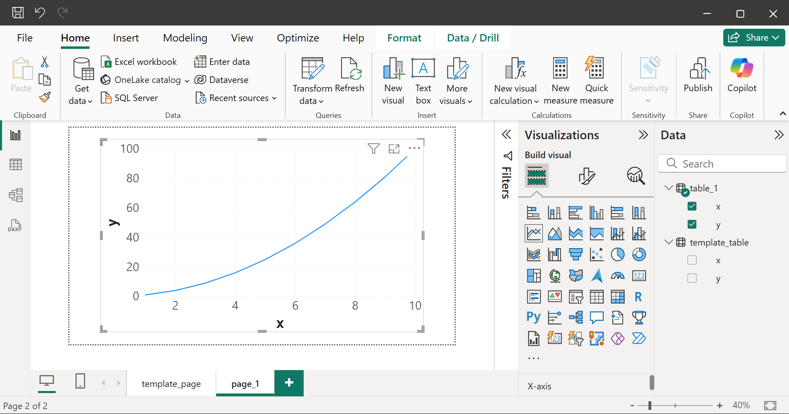

# Project 2: Creating Power BI reports using Python

{width="500"}

## Power BI Projects (PBIP)
A Power BI Project (PBIP) defines a Power BI report using a folder of plain text files. By using PBIPs, we can edit Power BI reports using a programming language, such as Python.     

A PBIP folder contains a:

- `.Report` folder
- `.SemanticModel` folder
- `.pbip` file

### `.Report` folder  
Defines all the report pages in the Power BI report.  

{width="1000"}

1. Each folder in the `pages` folder defines a report page. 
2. Each `visual.json` file defines a data visualization. For example, the file specifies the type of data visualization, and which data tables from the semantic model to use to create the visualization. 

### `.SemanticModel` folder
Defines the data tables that are used to create the data visualizations in the report pages. 

{width="700"}

1. Each `.tmdl` file in the `tables` folder defines a Power Query query.

### `.pbip` file
A Power BI report such that changes made to the `.Report` and `.SemanticModel` folders will change the `.pbip` file. Furthermore, changes made to the `.pbip` file using the Power BI graphical user interface will change the `.Report` and `.SemanticModel` folders. 

{width="900"}
/// caption
`project.pbip`
///

## Python code  

I used the following Python packages: 

- :material-folder-outline: `pathlib` to represent filesystem paths. 
- :material-content-copy: `shutil` to copy files and folders.
- :material-code-json: `json` to edit `.json` files. 
- :material-shape-outline: `typing` to add type hints.    
<br>

**1.** Create a variabe to store the path of the `pages` folder.  

``` py title="add_pages_to_report.py"
project_path = Path(r"") # paste the path to the Power BI project folder 
pages_path = project_path / "project.Report" / "definition" / "pages"
```

**2.** Create a copy of the `template_page` folder named `page_1`. 

``` py title="add_pages_to_report.py"
def copy_template_page(new_page_name: str) -> None:
    template_page_path = pages_path / "template_page"
    new_page_path = pages_path / new_page_name
    shutil.copytree(template_page_path, new_page_path)


copy_template_page("page_1")
```

{width="600"}
/// caption
`project.Report/definition/pages`
///

**3.** Edit `page.json` to change the name of the new page from `template_page` to `page_1`.  

``` py title="add_pages_to_report.py"
def edit_page_json(new_page_name: str) -> None:
    page_json = pages_path / new_page_name / "page.json"
    with open(page_json, 'r') as f:
        page_json_data = json.load(f)

    page_json_data['name'] = new_page_name
    page_json_data['displayName'] = new_page_name

    with open(page_json, 'w') as f:
        json.dump(page_json_data, f, indent=4)


edit_page_json("page_1")
```  

=== "before"
    `project.Report/definition/pages/page_1/page.json`
    ``` json
    "name": "template_page",
    "displayName": "template_page",
    ```

=== "after"
    `project.Report/definition/pages/page_1/page.json`
    ``` json
    "name": "page_1",
    "displayName": "page_1",
    ```

**4.** 	Edit `visual.json` to change the data displayed in the line graph from `template_table` to 
`table_1`. I use a recursive function to assign `i.value = "table_1"` for all nested items `i` in `visual.json` such that  `i.key == "Entity"`.

``` py title="add_pages_to_report.py"
def update_dict(dictionary, search_key: Hashable, new_value: Any) -> None:
    for key, value in dictionary.items():
        if key == search_key:
            dictionary[key] = new_value
        elif isinstance(value, dict):
            update_dict(value, search_key, new_value)
        elif isinstance(value, list):
            for element in value:
                if isinstance(element, dict):
                    update_dict(element, search_key, new_value)


def edit_visual_json(new_page_name: str, new_table_name: str) -> None:
    visual_json = pages_path / new_page_name / "visuals" / "line_graph" / "visual.json"
    with open(visual_json, 'r') as f:
        visual_json_data = json.load(f)

    update_dict(visual_json_data, "Entity", new_table_name)

    with open(visual_json, 'w') as f:
        json.dump(visual_json_data, f, indent=4)


edit_visual_json("page_1", "table_1")
```

=== "before"
    `project.Report/definition/pages/page_1/visuals/line_graph/visual.json`
    ``` json
    "Entity": "template_table",
    ```

=== "after"
    `project.Report/definition/pages/page_1/visuals/line_graph/visual.json`
    ``` json
    "Entity": "table_1",
    ```   

## Edited Power BI Report

=== "before"
    {width="900"}
    /// caption
    `project.pbip`
    ///

=== "after"
    {width="900"}
    /// caption
    `project.pbip`
    ///

To simplify this example, I only created one report page. However, at work, I used Python 
to automate the creation of hundreds of report pages. 
